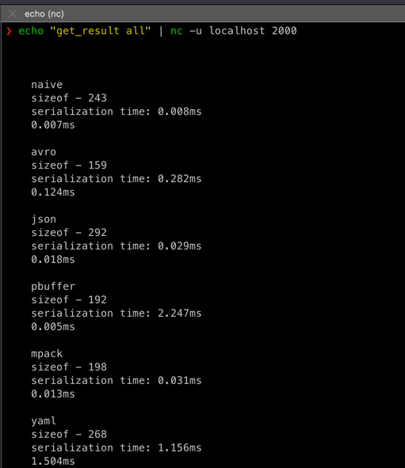

SOA/hw-1
Сериализация и десериализация различных форматов данных

Для запуска контейнера выполните следующие команды:
```
docker-compose build && docker-compose up
```

Для запуска программы внутри запущенного образа выполните следующую команду:
```
echo "get_result naive" | nc -u localhost 2000
```
Вместо naive можно передавать любой формат из этих
    "all" - для всех форматов, 
    "naive",
    "avro",
    "json",
    "pbuffer",
    "mpack",
    "yaml",
    "xml"


И контейнер ответит
```
    naive
    sizeof - 243
    serialization time: 0.010ms
    deserialization time: 0.010ms
```

Программа возвращает количество байт, занимаемых переданной структурой в выбранном формате и скорость сериализации и десериализации.

Результат работы
