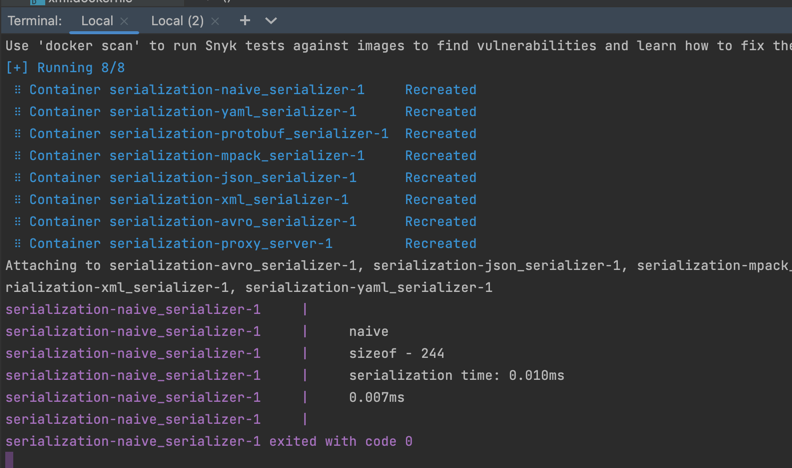

SOA/hw-1
Сериализация и десериализация различных форматов данных

Для запуска контейнера выполните следующие команды:
```
docker-compose build && docker-compose up
```

Для запуска программы внутри запущенного образа выполните следующую команду:
```
echo "time naive" | nc -u localhost 8080
```
Вместо naive можно передавать любой формат из этих
    "naive",
    "avro",
    "json",
    "pbuffer",
    "mpack",
    "yaml",
    "xml"


И контейнер ответит
```
serialization-naive_serializer-1     |     naive
serialization-naive_serializer-1     |     sizeof - 244
serialization-naive_serializer-1     |     serialization time: 0.010ms
serialization-naive_serializer-1     |     0.007ms
```

Программа возвращает количество байт, занимаемых переданной структурой в выбранном формате и скорость сериализации и десериализации.

Результат работы

